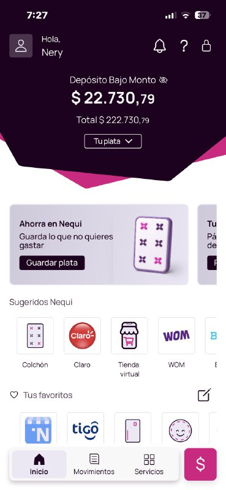
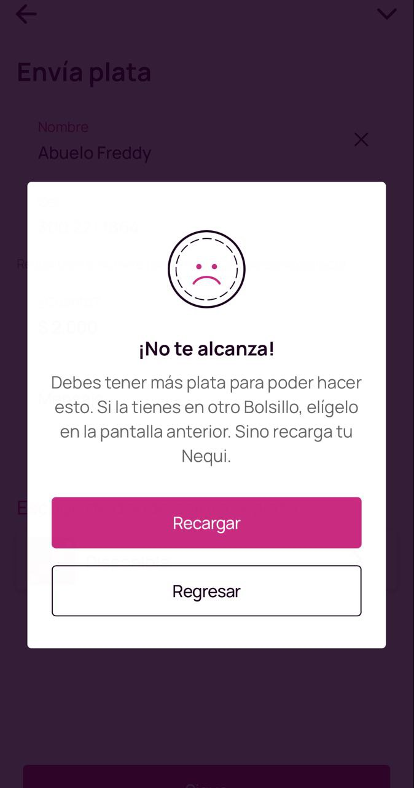
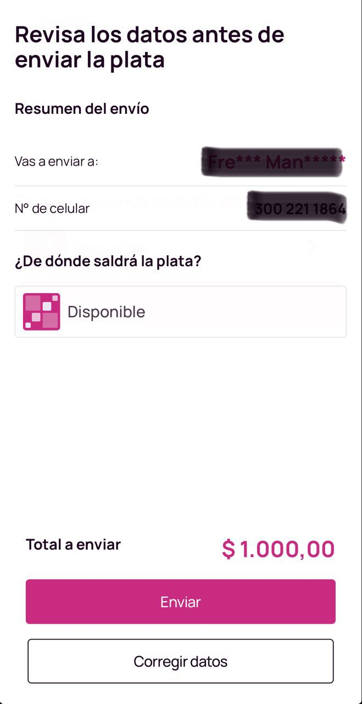
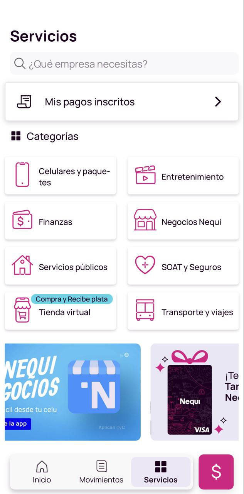
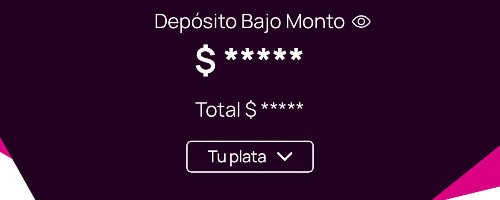
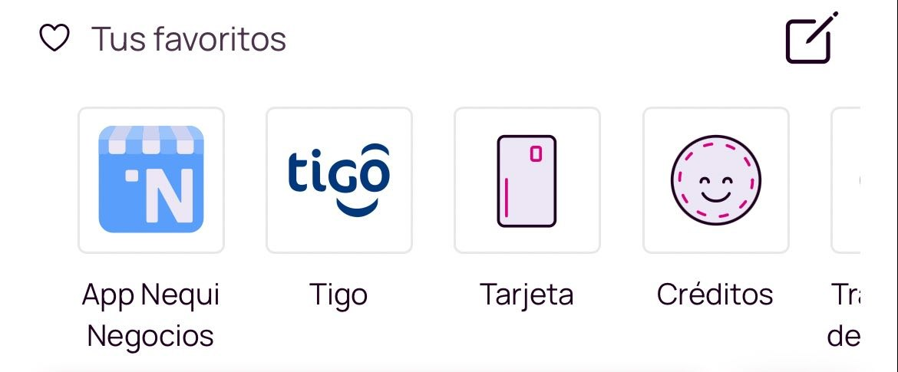
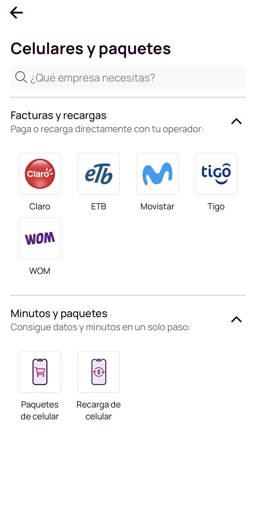
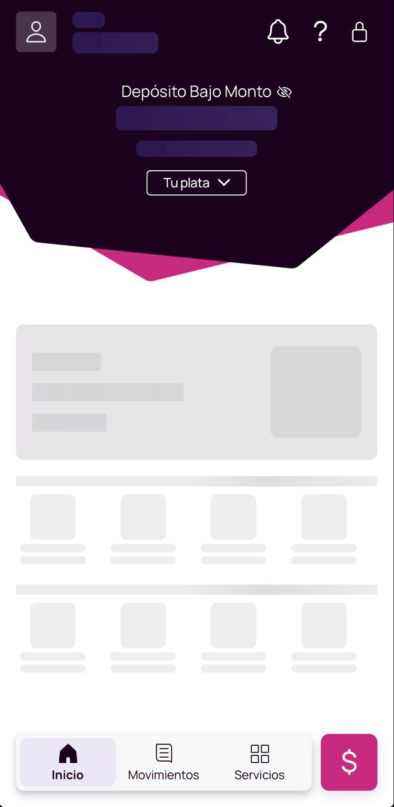
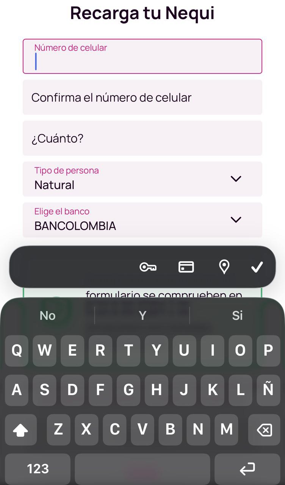
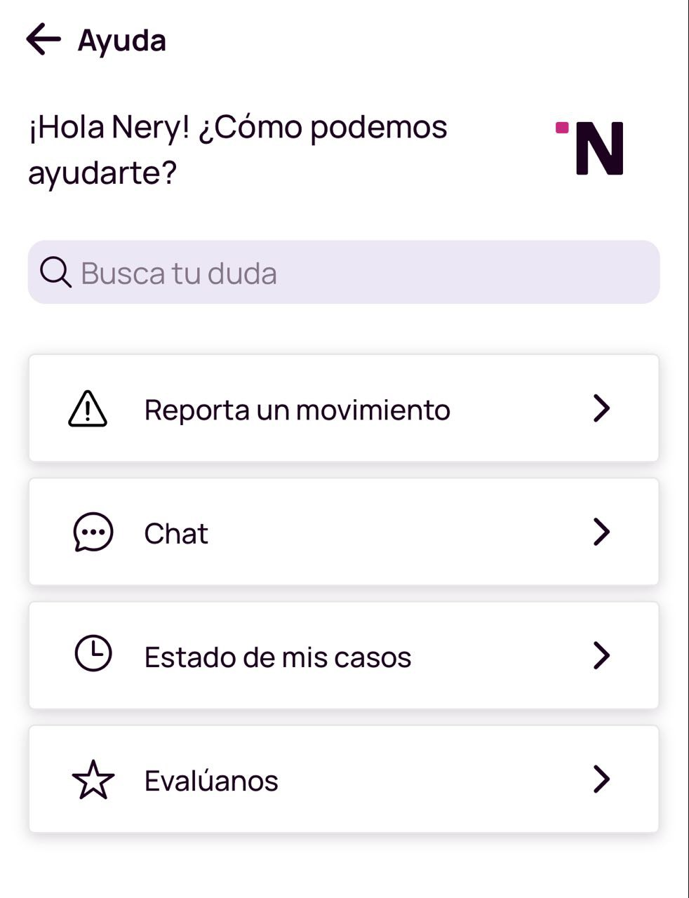

# Checklist Heurístico - Auditoría Nequi

## Tabla de Evaluación General
se tomara en cuenta lo siguiente: Heurística,Cumplimiento,Notas y Severidad (0-4) en ese orden:

H1: Visibilidad del estado 

H2: Lenguaje del mundo real 

H3: Control del usuario

H4: Consistencia 

H5: Prevención de errores

H6: Reconocimiento 

H7: Flexibilidad de uso

H8: Estética minimalista

H9: Recuperación de errores

H10: Ayuda 

## Registro de Hallazgos 
ID,Heurística Violada,Pantalla,Descripción del Problema,Evidencia,Severidad:

# Checklist Heurístico - Auditoría Nequi

| ID | Heurística Violada | Pantalla | Descripción del Problema | Evidencia | Severidad |
| :--- | :--- | :--- | :--- | :--- | :---: |
| **H8-A** | H8: Estética y diseño | Inicio | Exceso de elementos visuales y publicidad en "Sugeridos". |  | 1 |
| **H9-B** | H9: Recuperación de errores | Error saldo | El mensaje bloquea al usuario sin dar opción de usar "Bolsillos". |  | 3 |
| **H3-B** | H3: Control y libertad | Confirmación | No existe opción de "Deshacer" o cancelar el envío de inmediato. |  | 4 |
| **H4-C** | H4: Consistencia | Servicios | Mezcla de logos comerciales con iconos planos propios de la app. |  | 2 |
| **H2-A** | H2: Mundo real | Perfil | Uso de lenguaje técnico como "Depósito de bajo monto". |  | 2 |
| **H6-B** | H6: Reconocimiento | Favoritos | Solo muestra iniciales; no permite identificar visualmente al contacto. |  | 2 |
| **H7-B** | H7: Flexibilidad | Pagos | No recuerda datos de servicios no frecuentes, obligando a reescribir. |  | 3 |
| **H1-C** | H1: Estado del sistema | Carga | El saldo oculto por red lenta no muestra un indicador de carga claro. |  | 2 |
| **H5-C** | H5: Prevención errores | Recargas | Despliegue de teclado alfanumérico en campos numéricos. |  | 1 |
| **H10-B** | H10: Ayuda | Asistente | Ruta compleja y oculta para contactar a un asesor humano real. |  | 3 |
